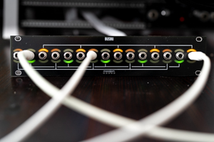
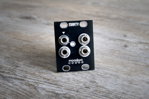
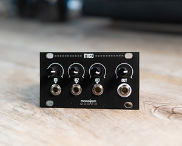
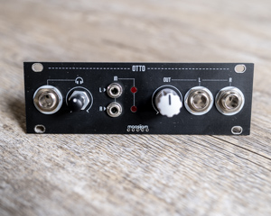
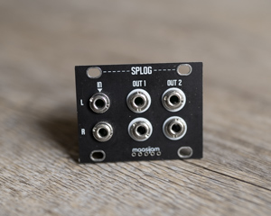
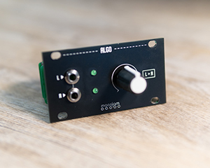
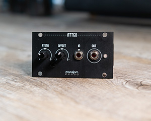
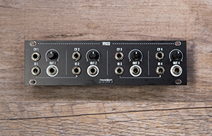

<h1>maasijam 1u Modules (Intellijel format) </h1>

**BUSBU** - Passive multiple cv-bus - [more...](busbu/) 

**MARTY** - a buffered multiple - [more...](https://github.com/maasijam/eurorack/tree/master/1u/marty) 

**MIGO** - a three channel CV / audio mixer - [more...](https://github.com/maasijam/eurorack/tree/master/1u/migo) 

**OTTO** - a simplified clone of Befacos out module for 1u - [more...](https://github.com/maasijam/eurorack/tree/master/1u/otto) 

**MIVA** - a USB MIDI to CV converter - [more...](https://github.com/maasijam/eurorack/tree/master/1u/miva) 

**SPLOG** - a simple module to multiple a stereo signal - [more...](https://github.com/maasijam/eurorack/tree/master/1u/splog) 

**ALGO** - an output module for Intellijels Palette 62 case - [more...](https://github.com/maasijam/eurorack/tree/master/1u/algo) 

**ATTGO** - an attenuverter module with offset - [more...](https://github.com/maasijam/eurorack/tree/master/1u/attgo) 

**VAGO** - a simple quad vca - [more...](https://github.com/maasijam/eurorack/tree/master/1u/vago) 

