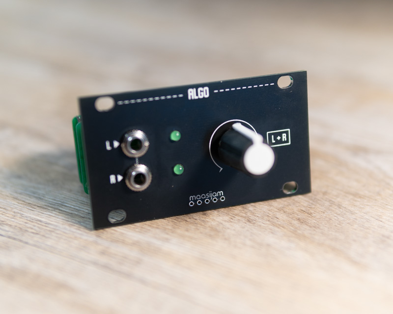
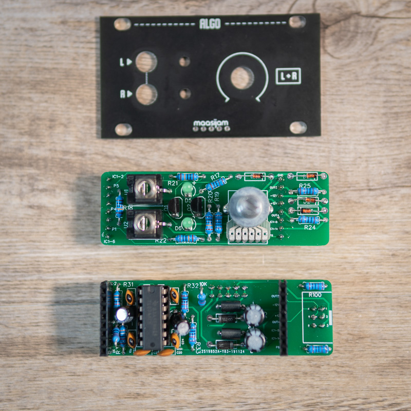
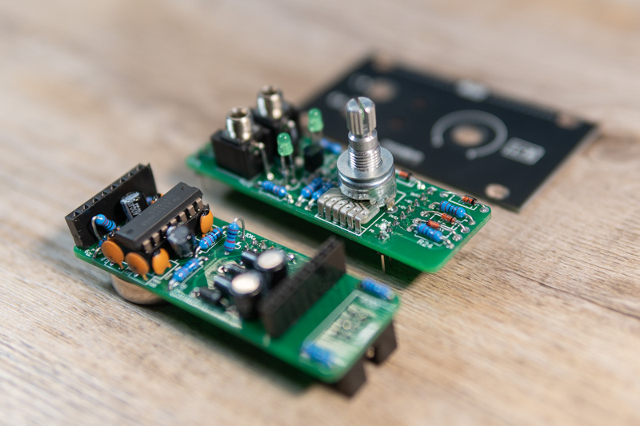
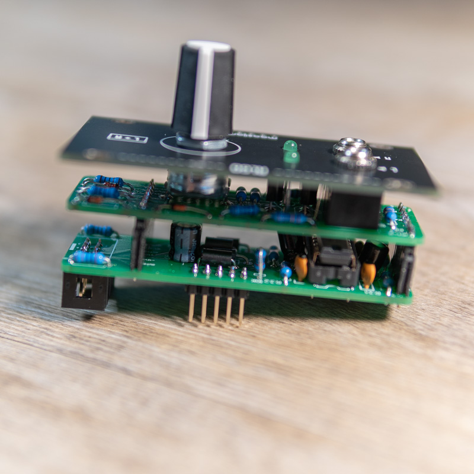
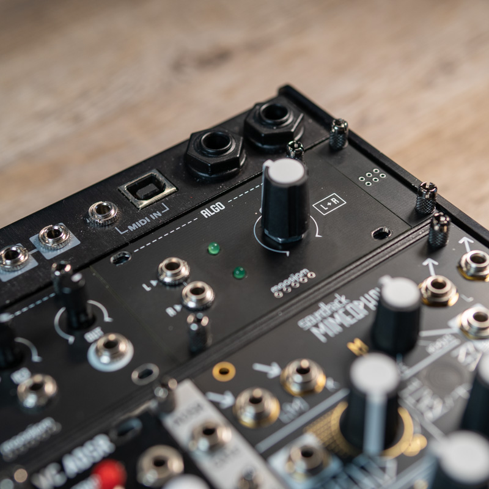

<h1>ALGO</h1>

Algo is a 1u output module based on the [Befaco Out V3](https://www.befaco.org/out-v3/) schematic.
 You need separate 1/4″ balanced audio jacks that can be connected to the 2*3 male pin header of the ALGO. I use the Intellijel Palette 62 case's built-in jacks.

Disclaimer: This is a DIY project. Use at your own risk.

<b>!!! Only for non-commercial and non-profit uses !!!</b>

<h3>Schematics</h3>

[Befaco Out V3](https://www.befaco.org/out-v3/)

<h3>Gerber</h3>

[Gerber files for panel, front and back pcb](gerber/)

<h3>BOM</h3>

[Bill of materials as CSV](BOM____ALGO_2020-09-20_19-04-04.csv)

<h3>License</h3>
CC-BY-NC-SA

<h3>Images</h3>

