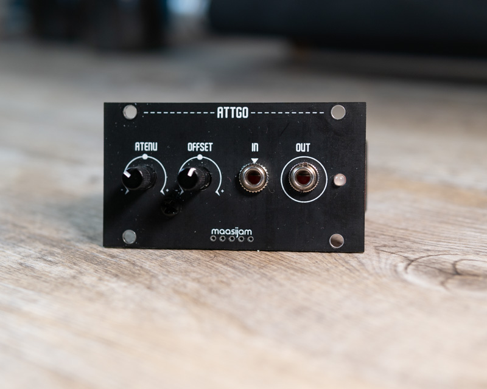
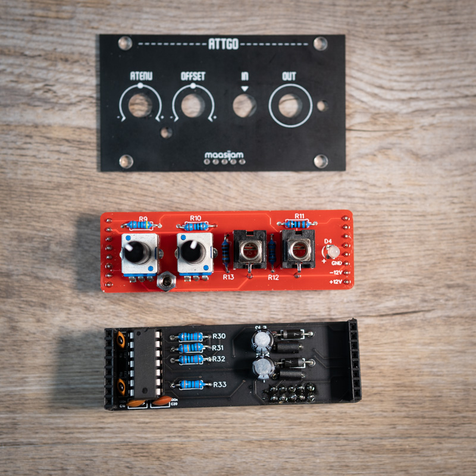
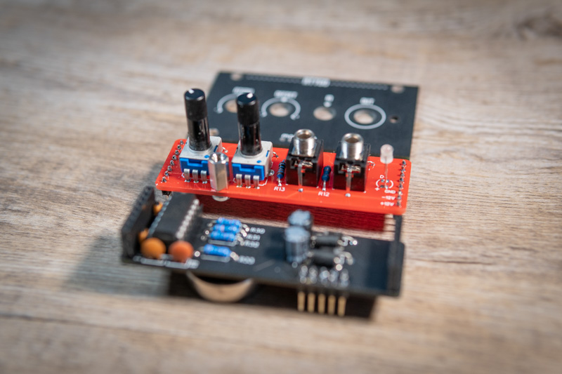
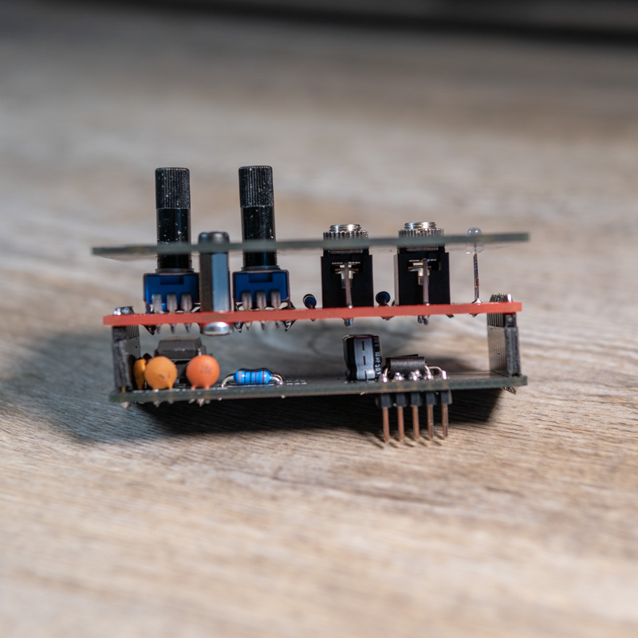
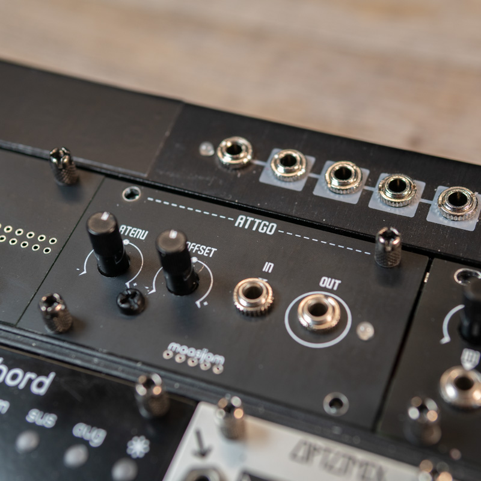

<h1>maasijam ATTGO 1u Attenuverter Module</h1>

This 1u attenuverter module is based on the Befaco Dual Atenuverter schematic.
 [Befaco Dual Atenuverter](https://www.befaco.org/en/dual-atenuverter/)

Disclaimer: This is a DIY project. Use at your own risk.

<h3>Schematics</h3>

[Befaco Dual Atenuverter](https://www.befaco.org/dual-atenuverter/)

<h3>Gerber</h3>

[Gerber files for panel, front and back pcb](gerber/)

<h3>BOM</h3>

[Bill of materials as CSV](BOM_attgo_v002_2020-12-27_13-56-19.csv)

<h3>License</h3>
CC-BY-NC-SA

