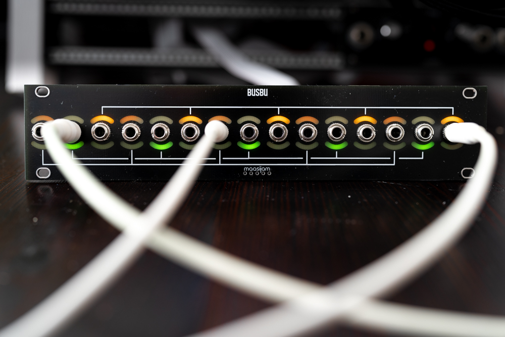
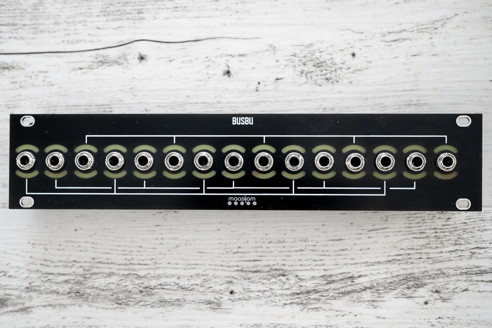
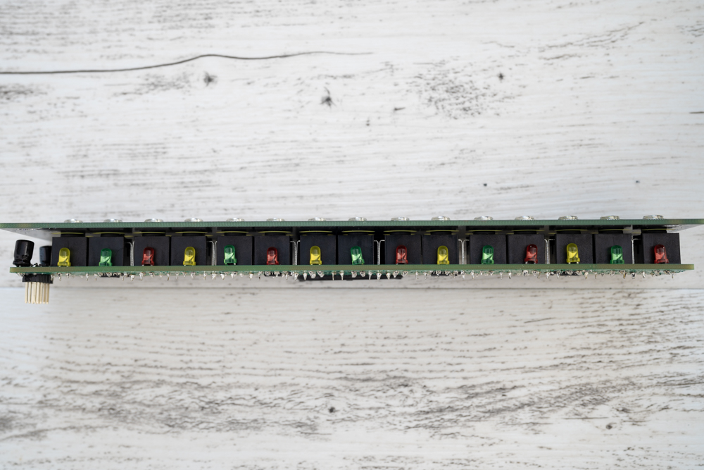
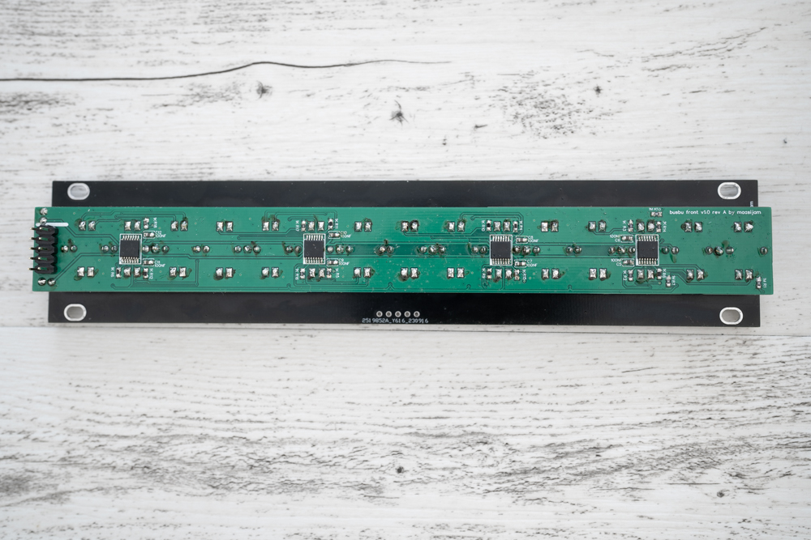

# BUSBU
Passive multiple cv-bus eurorack module (inspired by the Make Noise CV bus)

<b>Overview:</b>
* 3 channels a 5 in/out jacks
* Leds for bipolar signals. Above the jacks positive and below negative voltage
* 1u Intellijel
* 38 HP

[Modulargrid](https://www.modulargrid.net/e/other-unknown-busbu)

<b>Disclaimer:</b>  
This is a DIY project. Use at your own risk. 
Because of the tiny ICs (TSSOP-14), you should have experience in soldering.

<b>Licence</b> 
CC BY-NC-SA 

