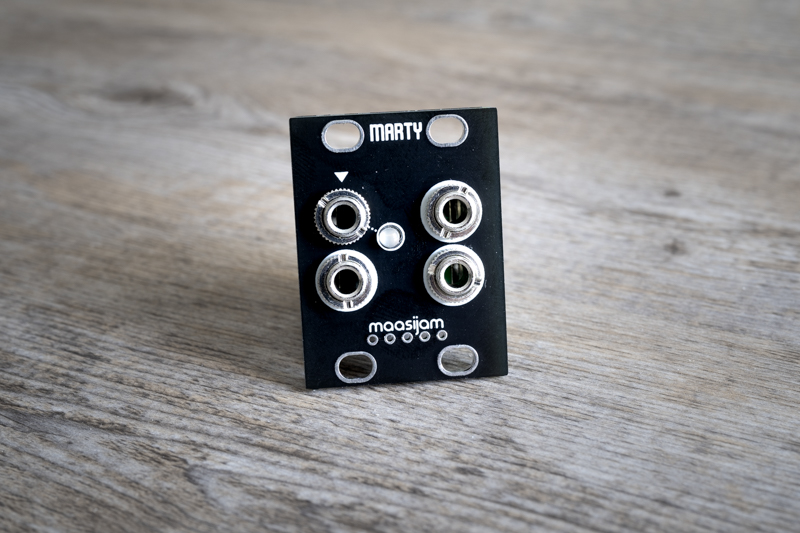
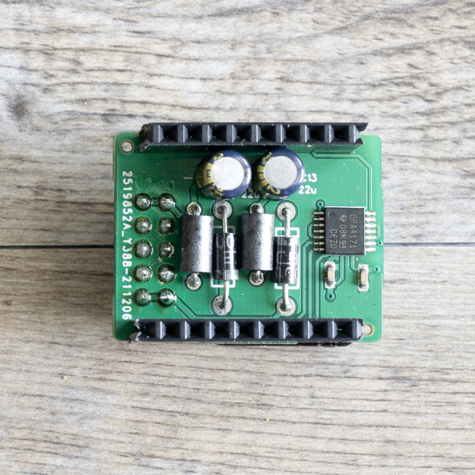
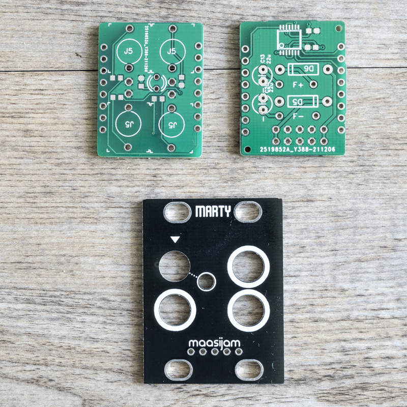

<h1>maasijam MARTY 1u buffered multiple</h1>

This 1u buffered multiple module is based on the Mutable Instruments Links schematic.
 [Mutable Instruments Links](https://mutable-instruments.net/modules/links/)

Disclaimer: This is a DIY project. Use at your own risk.

<h3>Gerber</h3>

[Gerber files for panel, front and back pcb](gerber/)

<h3>BOM</h3>

[Bill of materials as CSV](BOM_marty_2022-06-04.csv)

