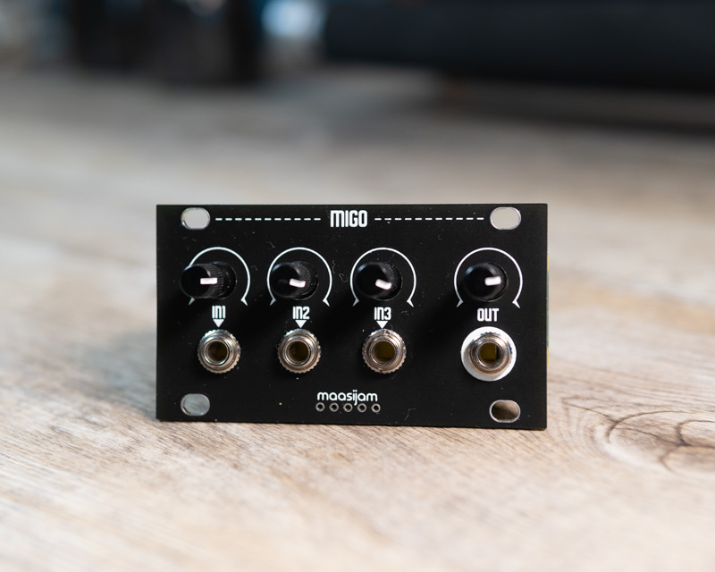
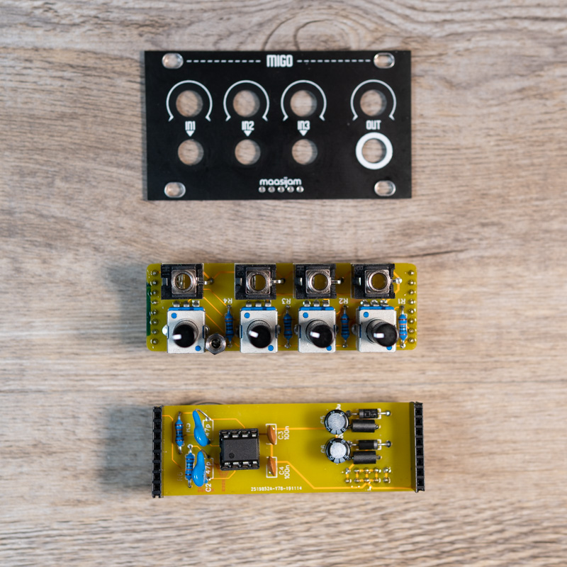
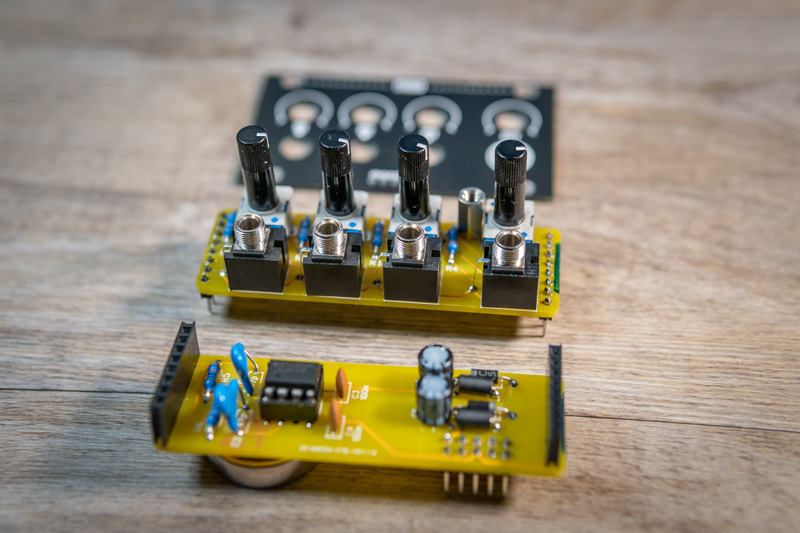
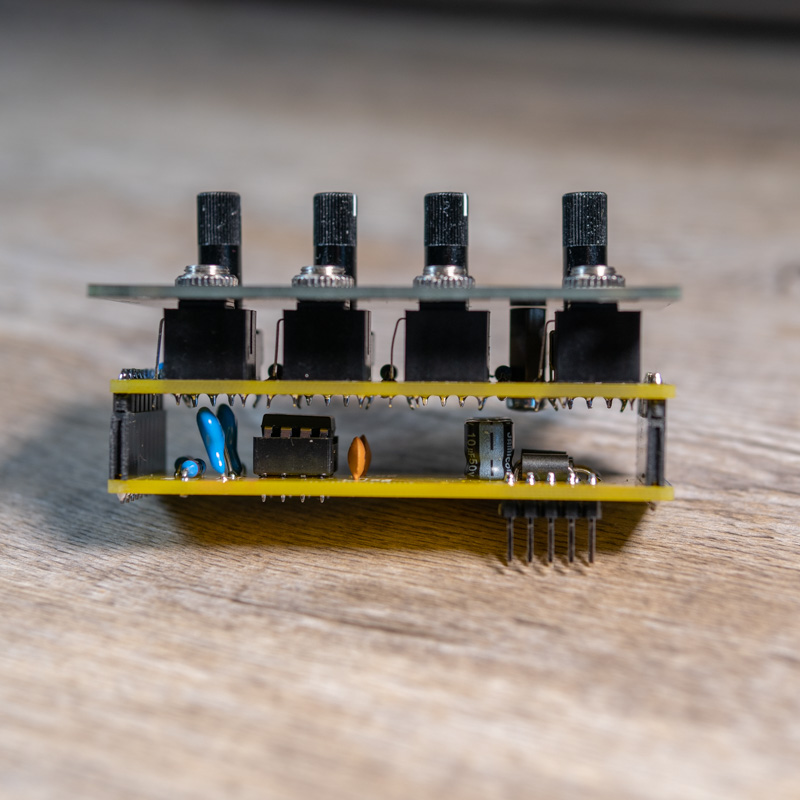
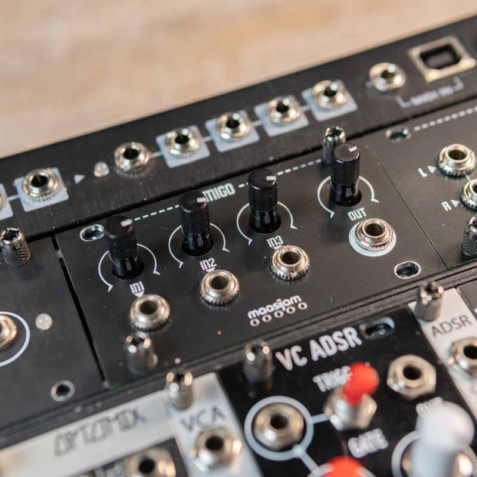

<h1>maasijam MIGO 1u Mixer Module</h1>

This 1u mixer module is based on the AI Synthesis AI002 Audio and CV Mixer schematic.
 [AI Synthesis AI002 Audio and CV Mixer](https://aisynthesis.com/product/eurorack-audio-and-cv-mixer/)

Disclaimer: This is a DIY project. Use at your own risk.

<b>!!! Only for non-commercial and non-profit uses !!!</b>

<h3>Gerber</h3>

[Gerber files for panel, front and back pcb](gerber/)

<h3>BOM</h3>

[Bill of materials as CSV](BOM_migo.csv)

