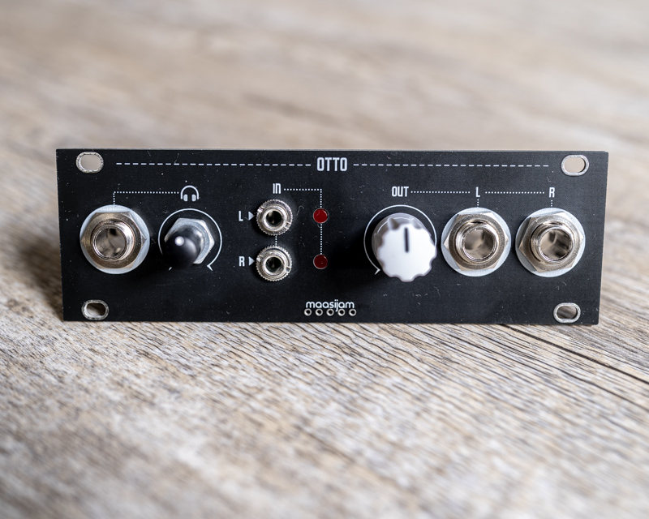
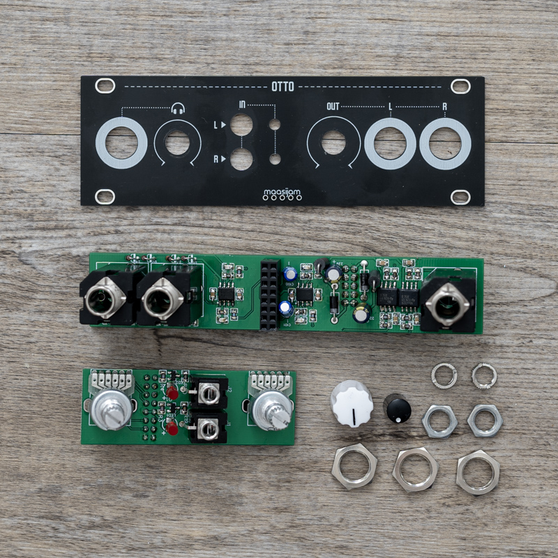
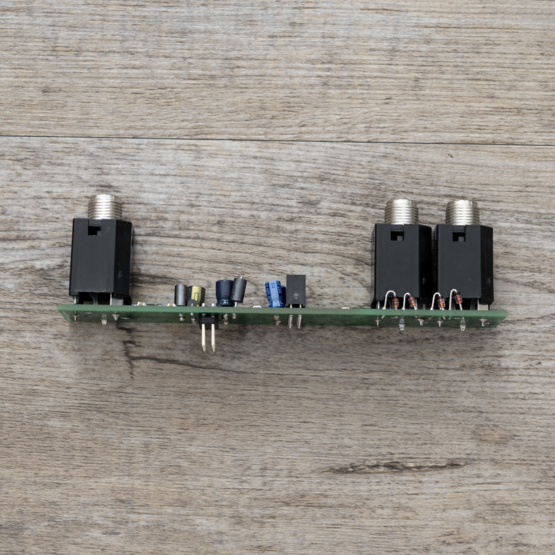
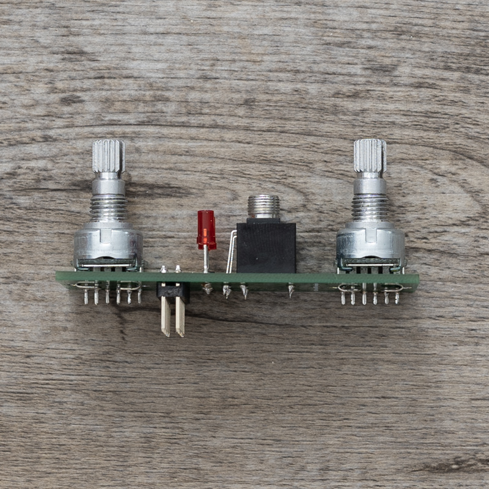

<h1>OTTO</h1>

Otto is a 1u output module based on the [Befaco Out V3](https://www.befaco.org/out-v3/) schematic.

Disclaimer: This is a DIY project. Use at your own risk. 
<b>!!! Only for non-commercial and non-profit uses !!!</b>

<h3>Schematics</h3>

[Befaco Out V3](https://www.befaco.org/out-v3/)

<h3>Gerber</h3>

[Gerber files for panel, front and back pcb](gerber/)

<h3>BOM</h3>

[Bill of materials as CSV](BOM_otto_1u_2021-08-07.csv)

<h3>License</h3>
CC-BY-NC-SA

<h3>Images</h3>

