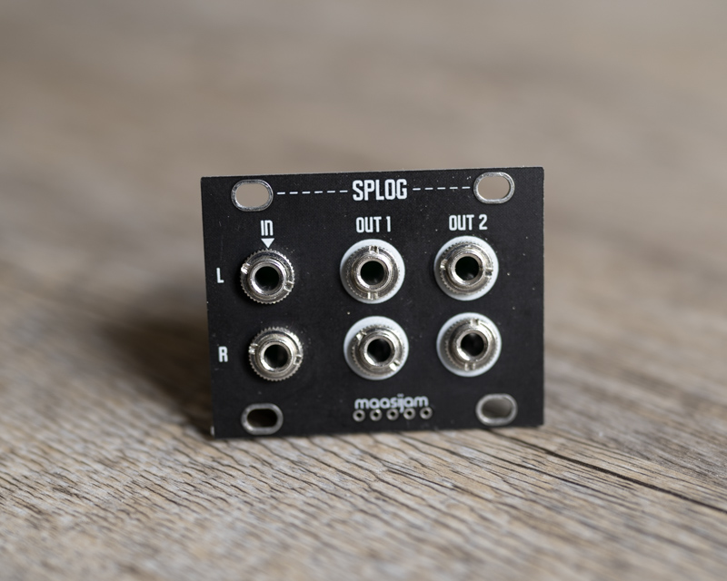
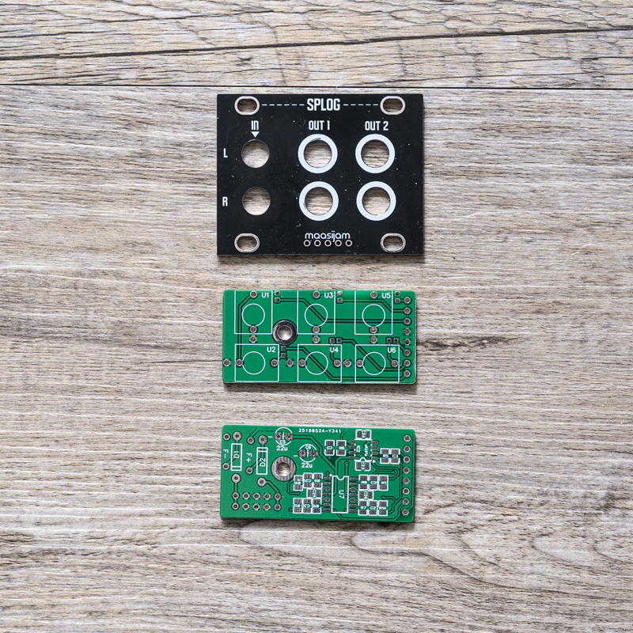
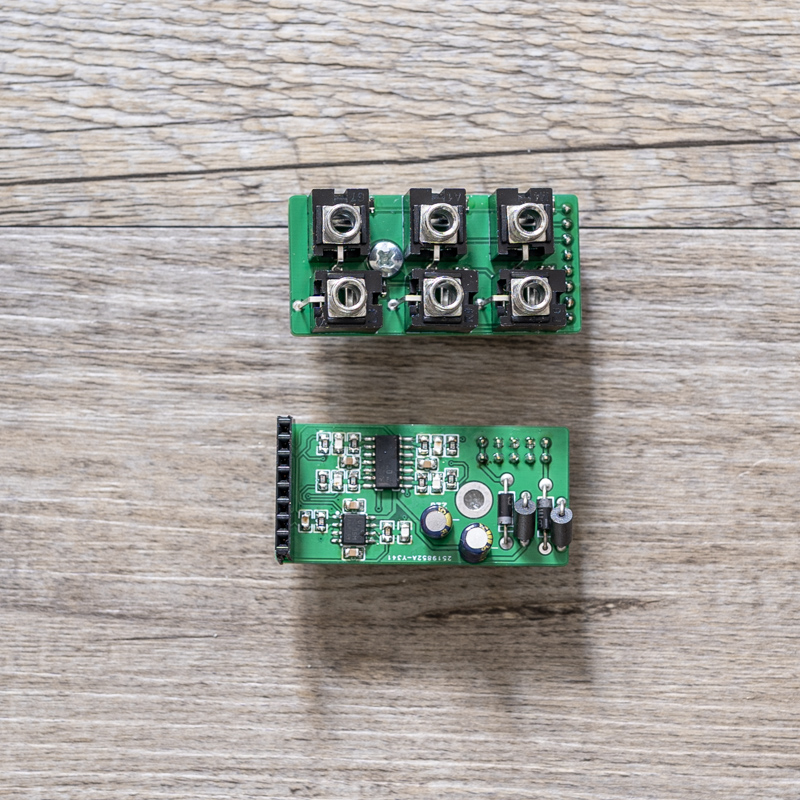
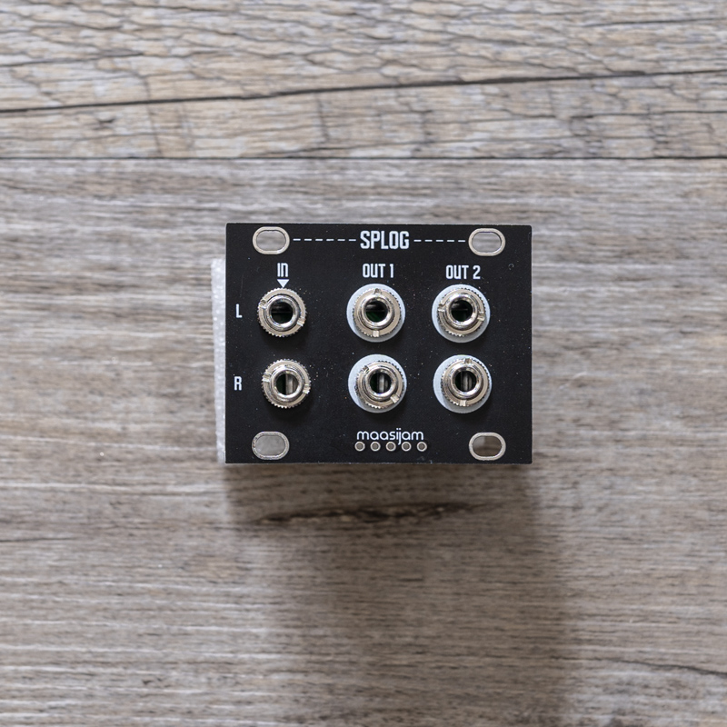
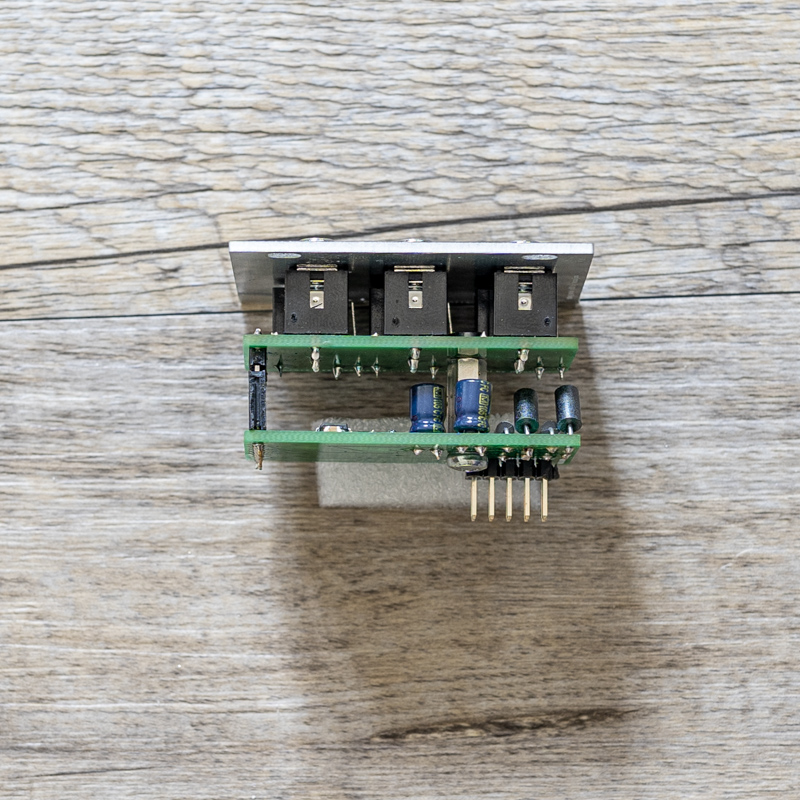

<h1>SPLOG</h1>

SPLOG is a simple 1u module for copying a stereo audio signal.

Disclaimer: This is a DIY project. Use at your own risk. 
<b>!!! Only for non-commercial and non-profit uses !!!</b>

<h3>Schematics</h3>

[Schematic_SPLOG_2021-08-19.pdf](Schematic____SPLOG_2021-08-19.pdf)

<h3>Gerber</h3>

[Gerber files for panel, front and back pcb](gerber/)

<h3>BOM</h3>

[Bill of materials as CSV](BOM_splog_v001_2021-08-19.csv)

<h3>Images</h3>

