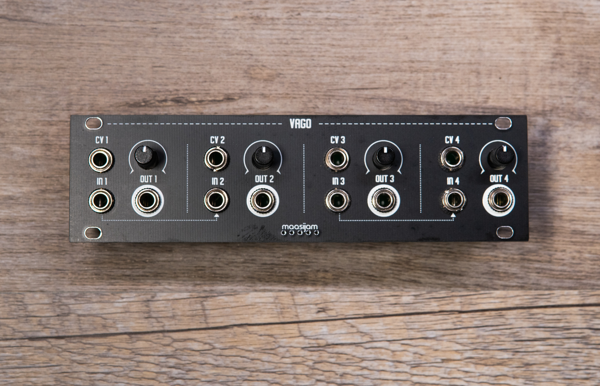
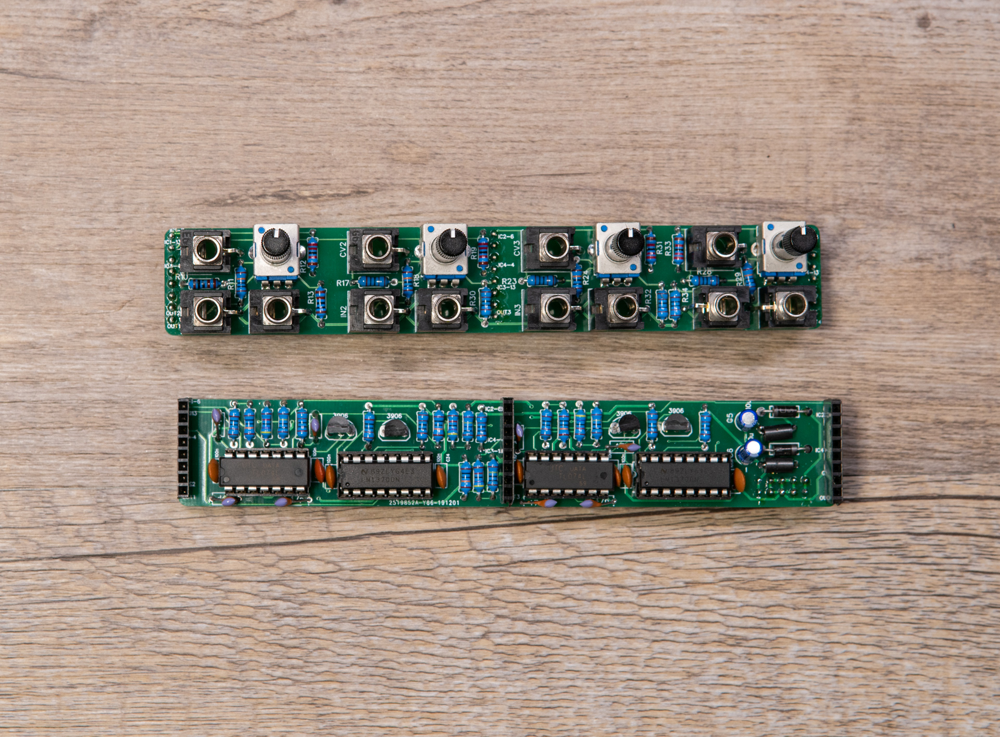
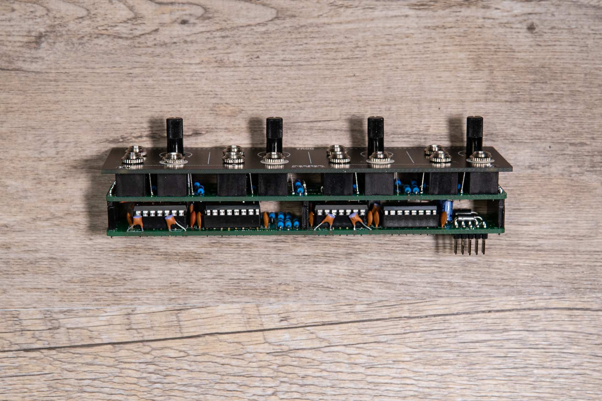

<h1>VAGO</h1>

**VAGO** - is a simple quad vca in 1u format based on bastl instruments ["Quattro Figaro"](https://bastl-instruments.com/eurorack/modules/quattro-figaro)

* CV INs with attenuators
* The signal from input 1 is normaled to inputs 1/2, and the signal from input 3 is normaled to inputs 3/4
* Completely through-hole
* 28HP    
* 16 mA +12V
* 16 mA -12V
* 0 mA 5V

Disclaimer: This is a DIY project. Use at your own risk.

<h3>Schematics</h3>

[Bastl Instruments Quattro Figaro](https://bastl-instruments.com/eurorack/modules/quattro-figaro) (scroll down to DIY Kit section)

<h3>Gerber</h3>

[Gerber files for panel, front and back pcb](gerber/)

<h3>BOM</h3>

[Bill of materials as CSV](BOM____VAGO_2020-09-03_22-37-59.csv)

<h3>Images</h3>

