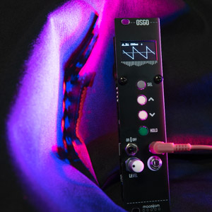

<h1>maasijam 3u Modules</h1>

**WYATT** - A Daisy Seed based Eurorack module - [more...](https://github.com/maasijam/WYATT) 

**MONOFA** - A Norns for Eurorack - [more...](https://github.com/maasijam/MONOFA) 

**OSGO** - a simple Arduino Nano based oscilloscope - [more...](https://github.com/maasijam/eurorack/tree/master/3u/osgo) 

