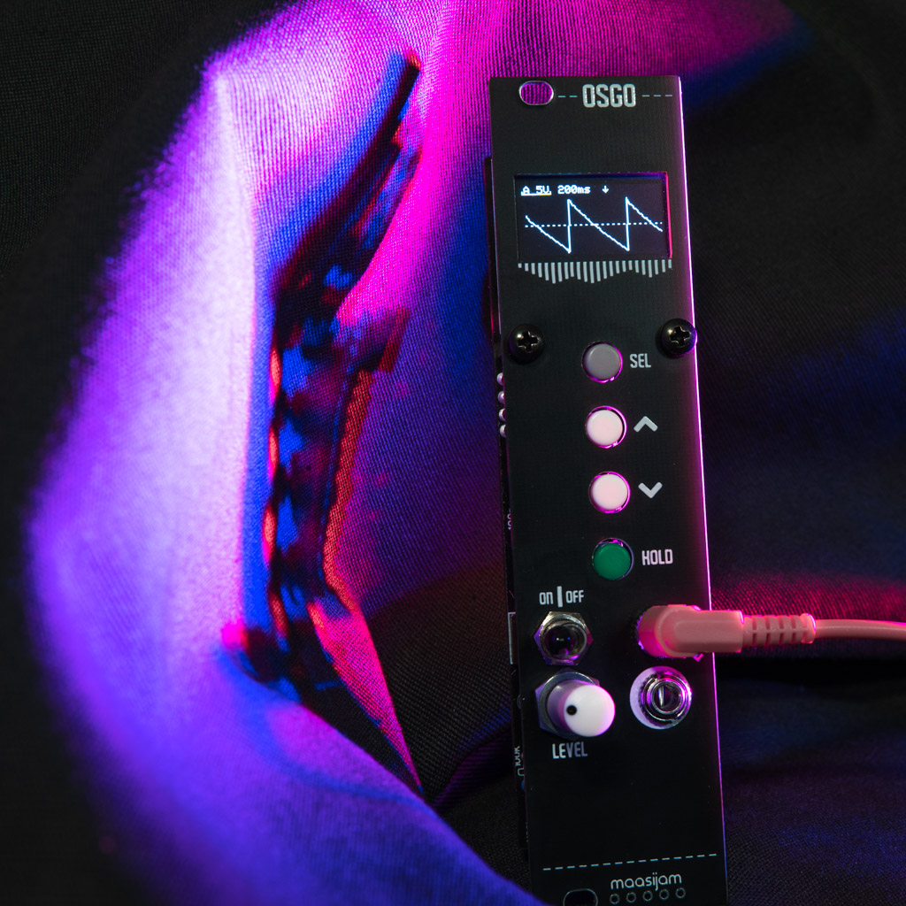
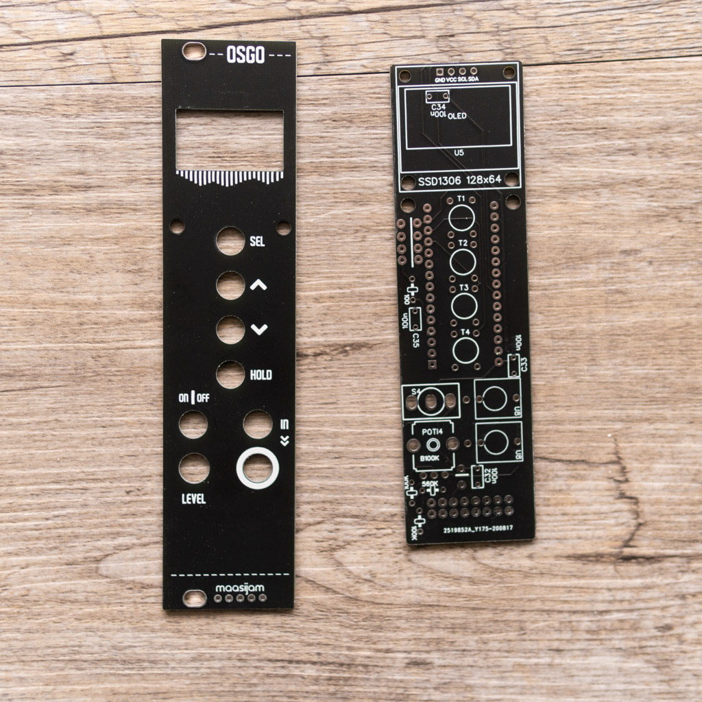
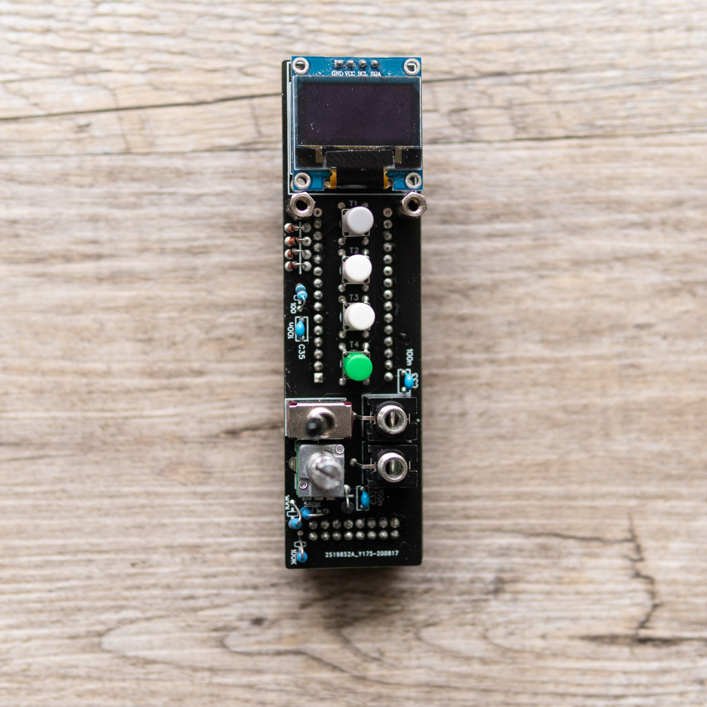
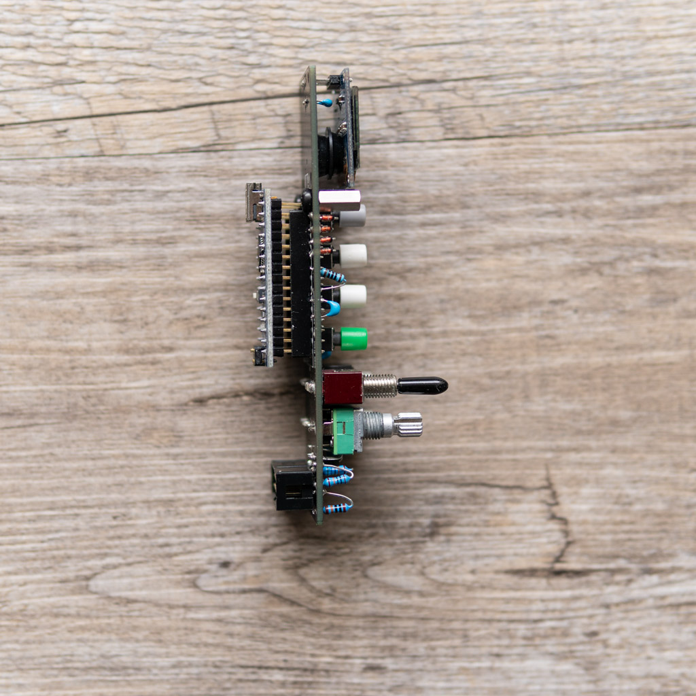

<h1>maasijam OSGO - A very simple Arduino Nano based oscilloscope in Eurorack format</h1>

This is a simple oscilloscope eurorack module. It is based on the "Scope-O-Matic" module. 
Schematics and source code can be found here:
[Scope-O-Matic](https://lookmumnocomputer.discourse.group/t/scope-o-matic-an-arduino-nano-based-oscilloscope-in-euro-rack-format/1565)

Disclaimer: This is a DIY project. Use at your own risk.

<h3>Gerber</h3>

[Gerber files for panel and front pcb](gerber/)
  

